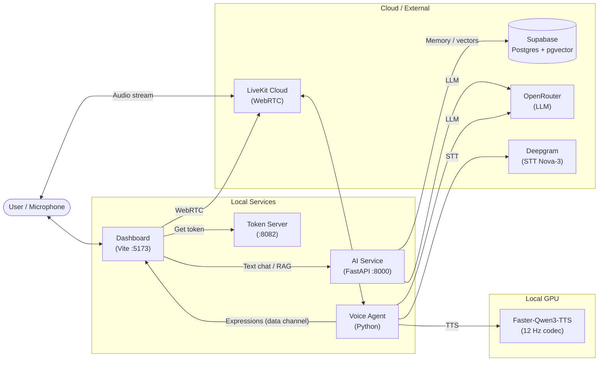

# AURA System Architecture

> Technical reference for developers. Covers component interactions, data flow, and deployment modes.

## 1. High-Level Overview

AURA is a **local-first, cloud-backed** AI companion. It supports both native execution (via `start_aura.bat`) and containerized deployment (via Docker Compose).

| Component | Role |
|-----------|------|
| **Dashboard** | React 19 + Vite frontend. Renders the Live2D avatar, handles voice calls via LiveKit WebRTC, provides chat and settings UI. |
| **Voice Agent** | Python LiveKit worker. Runs the STT → LLM → TTS pipeline and forwards emotion tags to the avatar. |
| **AI Service** | FastAPI service for RAG (document ingestion, semantic search) and chat history via Supabase. |
| **Token Server** | Lightweight endpoint that issues LiveKit access tokens for the dashboard. |

## 2. Architecture Diagram



## 3. Component Details

### 3.1 Dashboard (`/dashboard`)

- React 19 + Vite + TailwindCSS 4
- **Avatar**: `AvatarRenderer.jsx` creates a PIXI Application, loads the Cubism 4 Live2D model via `pixi-live2d-display`, and monkey-patches `coreModel.update()` to inject idle animation parameters (head sway, blink FSM, eye saccades, breathing) every frame
- **Lip sync**: `CallOverlay.jsx` uses `createMediaStreamSource` + `AnalyserNode` to compute RMS amplitude from the LiveKit audio track and drive `ParamMouthOpenY`
- **Expressions**: received via LiveKit data channel from the voice agent; mapped to `.exp3.json` files on the Hu Tao model
- **Voice**: `livekit-client` SDK handles all WebRTC signaling and media

> pixi.js must remain at v6. pixi-live2d-display 0.4 is incompatible with pixi.js v7+.

### 3.2 Voice Agent (`/voice-agent`)

- `livekit-agents` v1.3+, Silero VAD
- STT: Deepgram Nova-3 (multilingual)
- LLM: OpenRouter (DeepSeek-V3 by default)
- TTS: `AuraTTS` class wrapping Faster-Qwen3-TTS locally
  - `max_new_tokens` budget prevents runaway audio generation on short phrases
  - Trailing silence trimmed by `_trim_silence()` after each synthesis
- Emotion tags from LLM output (`[happy]`, `[sad]`, etc.) parsed and forwarded to the dashboard via LiveKit data channel

### 3.3 AI Service (`/ai-service`)

- FastAPI (Python)
- RAG pipeline: document ingestion → embeddings → Supabase pgvector → semantic retrieval
- Endpoints:
  - `POST /api/v1/chat` — text chat with memory context
  - `POST /api/v1/memory` — ingest documents

### 3.4 Data Schema (Supabase)

| Table | Purpose |
|-------|---------|
| `conversations` | Conversation metadata (id, title, user_id) |
| `messages` | Chat history (content, role, emotion, created_at) |
| `memories` | Knowledge base (content, embedding vector, metadata) |
| `personality_settings` | System prompts, voice settings, emotional baselines |

## 4. Environment Variables

A single `.env` in the project root is shared by all services.

| Variable | Used by | Purpose |
|----------|---------|---------|
| `DEEPGRAM_API_KEY` | Voice Agent | Speech recognition |
| `OPENROUTER_API_KEY` | Voice Agent, AI Service | LLM inference and embeddings |
| `LIVEKIT_URL` | Voice Agent, Dashboard | LiveKit server |
| `LIVEKIT_API_KEY` / `_SECRET` | Voice Agent, Token Server | LiveKit credentials |
| `SUPABASE_URL` / `_KEY` | AI Service, Dashboard | Database and vectors |
| `VTUBE_ENABLED` | Voice Agent | Enable VTube Studio integration (default: `false`) |

## 5. Execution Modes

### Native (Zero-Docker)

`start_aura.bat` (Windows) / `start_aura.sh` (Unix):
1. Creates Python virtual environments for AI Service and Voice Agent
2. Installs dependencies if needed
3. Launches Token Server, Voice Agent, AI Service, and Dashboard as parallel processes

### Containerized (Docker)

```bash
docker compose up --build
```

Requires Docker Desktop and NVIDIA Container Toolkit for GPU-accelerated TTS.

## 6. Avatar System

The Live2D avatar is entirely browser-based — no external process is required.

```
Cubism 4 Core (WASM)          loaded via <script> in index.html
pixi-live2d-display            imports Cubism 4 subpackage
PIXI.Application               WebGL canvas, full-viewport
Live2DModel.from(url)          loads .model3.json + textures + physics
coreModel.update() patch       injects animation params before GPU commit
AnalyserNode (Web Audio)       drives ParamMouthOpenY for lip sync
LiveKit data channel           delivers expression names from voice agent
```

**Key Cubism 4 parameter IDs** (from `Hu Tao.cdi3.json`):

| Parameter | Description |
|-----------|-------------|
| `ParamAngleX/Y/Z` | Head rotation |
| `ParamBodyAngleX/Z` | Body sway |
| `ParamBreath` | Breathing |
| `ParamEyeLOpen` / `ParamEyeROpen` | Eye open/close |
| `ParamEyeBallX` / `ParamEyeBallY` | Eye gaze direction |
| `ParamMouthOpenY` | Mouth open (lip sync) |
| `ParamMouthForm` | Mouth shape (smile/frown) |
| `ParamBrowLForm` / `ParamBrowRForm` | Eyebrow shape |
| `ParamEyeLSmile` / `ParamEyeRSmile` | Eye squint |
