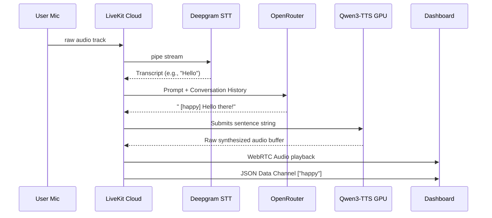

# Voice Pipeline Architecture

The Voice Pipeline orchestrates the critical pathway enabling users to speak to AURA and receive ultra-fast verbal responses with corresponding emotion tags. This entire workflow resides in the Python `voice-agent` application.

## The Workflow Map

## Component Breakdowns

### Speech-to-Text (Deepgram)
Deepgram's Nova-3 tier allows the `voice-agent` to interpret speech with sub-300ms latency. Because it is highly capable in multiple languages, the user does not need to declare which language they are speaking beforehand. 

### Local TTS Engine (Faster-Qwen3-TTS)
While Cloud TTS services (like ElevenLabs) offer fantastic voices, they suffer from internet backhaul latency and price constraints. AURA operates **Faster-Qwen3-TTS** entirely locally on GPU.
- **Why Fast?**: A 12 Hz codec and serialized CUDA calls ensure minimal buffer stalling.
- **Budget Control**: The generator computes `max_new_tokens` dynamically based on the string length of the LLM output. This aggressive cut-off prevents "hallucination loops" where the TTS outputs ambient static or endless silence at the end of generations.
- **Silence Trimming**: The internal `_trim_silence()` parses 25ms audio chunks backward, aggressively discarding dead trailing silence to ensure AURA immediately finishes her turn perfectly in sync with the end of her sentence.

### The Livekit Agent Toolkit
The `voice-agent` is built upon the `livekit-agents` v1.3 library. It inherently supplies Silero VAD (Voice Activity Detection), meaning it intelligently knows when a user is speaking, when they pause, and if they interrupt AURA. If the user interrupts, the Python token stream and TTS generator are halted, immediately silencing the character.
